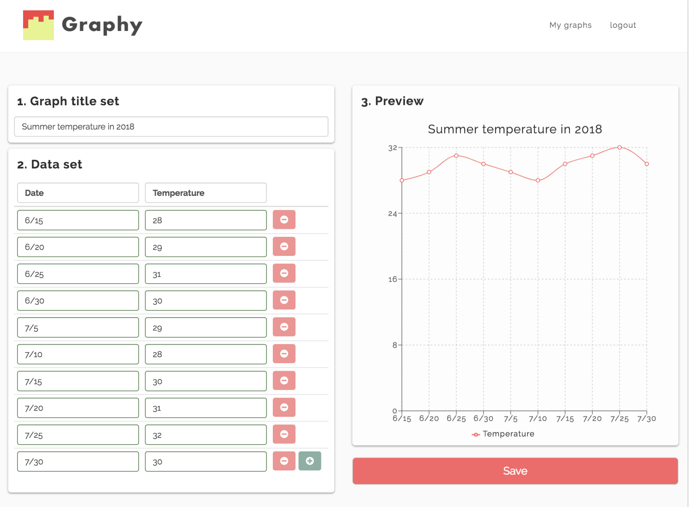

# Graphy

Graphy is a application to create and save your graphs. There are five types of graphs that can choose.

## Screen shot



## Installation

```
$ npm install
```
## Development

Start development

```
$ npm start
```